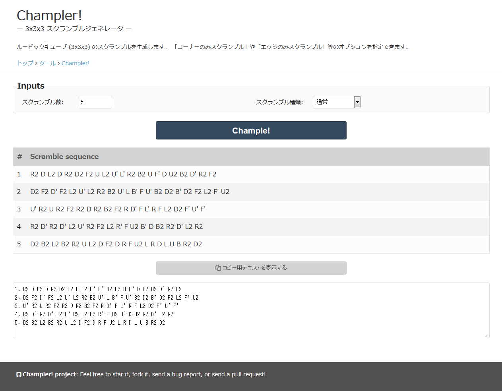

# Champler!

Champer! is a web applicition providing Rubik's cube scrambles (3x3x3).
This is a web interface of 3x3x3 scrambler/solver [chample](https://github.com/kotarot/chample).

## How to build HTML

`champler.html` is an HTML file already generated.
If you would like to generate your own HTML, do the followings.

Python (+Jinja2) need to be installed.
Write settings in `genhtml.py` and then excute the script:
```
python genhtml.py > champler.html
```

## Demo

* [http://wrcc.main.jp/tools/champler](http://wrcc.main.jp/tools/champler)

Screenshot:

